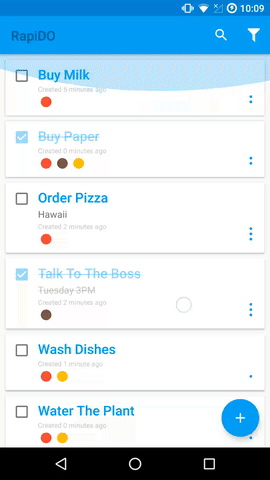

# RapiDO for Android - Powered By Rapid.io

RapiDO is a sample to-do list application for Android powered by Rapid.io real-time database. The app is supposed to showcase usage
of [Rapid.io Android SDK](https://github.com/Rapid-SDK/android)

## Instructions

1. Visit [http://www.rapid.io/demo](http://www.rapid.io/demo) and obtain a unique demo client ID which you can use
within your own build of this app
2. Clone this repository or download it as a [ZIP](https://github.com/Rapid-SDK/rapido-android/archive/master.zip)
3. Edit `Config.java` file and replace `RAPID_DEMO_CLIENT_ID` value with your client ID
4. Build and run the sample

## Credits

RapiDO and Rapid.io Android SDK is owned and maintained by [Rapid.io](http://www.rapid.io)

## License
Rapid.io Android SDK is released under the MIT license. See [LICENSE](/LICENSE.md) for details.